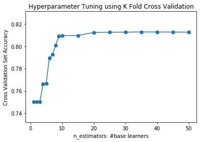
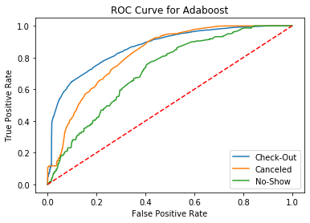
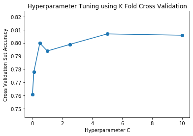
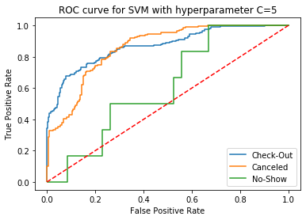
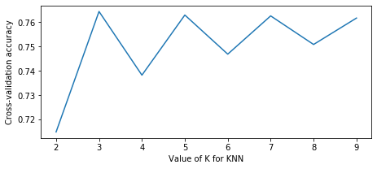
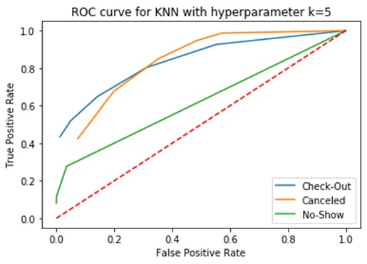
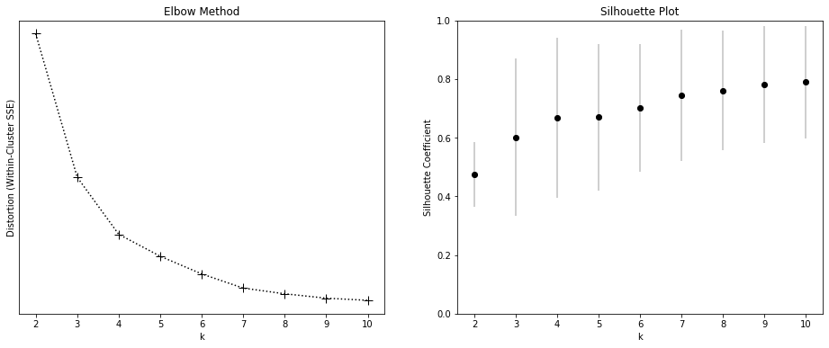
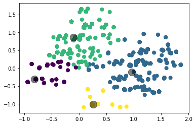
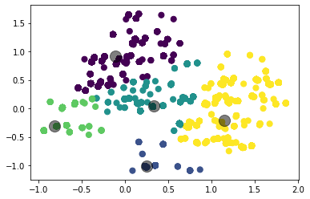

# Machine-Learning-Project
>Used hotel booking data (Kaggle) to assess the risk of accepting an individual or group room reservation

>Created Bootstrapping, K folds, ROC curve Algorithms from scratch (Without using Sklearn)

>Implemented and compared the results of Adaboost, Perceptron, SVM and Knn Models 

>Implemented K-means after finding number of clusters using elbow and Silhouette Method 

## Introduction
>The goal for this project is to use machine learning techniques and algorithms to develop a good prediction model for hotel cancellations and find. The data set is named hotel booking demand and can be found in the following link: https://www.kaggle.com/jessemostipak/hotel-booking-demand. The data set includes approximately 120,000 samples with 32 features. Some of the features included are the number of adults, number of children, number of weeknights booked by the guest, if they are a repeated guest, etc. I have taken the reservation status as our labels. The remaining features are transformed into a numerical representation depending on the algorithm run.
## Perceptron (using Bootstrapping for Cross Validation)
>Linear multiclass perceptron was used. A mean_list and eta_list was created to store average accuracy score and value of the hyperparameter eta during each run of the loop. Here eta represents the constant by which the updates are multiplied during a run of Perceptron.
>Bootstrapping is done 5 times for each value of eta. Bootstrapping is done such that 80% of training data is stored in ‘B_train’, and remaining samples not present in ‘B_train’ are stored in cross validation set ‘B_cross’. 
>The perceptron is fit on ‘B_train’ and tested on ‘B_cross’. The resulting accuracy score is stored and plotted vs eta value to obtain the below figure.

>

>From the above graph we see that accuracy is highest for a value of eta=0.4. But since I was Bootstrapping, we can expect slightly different values each time we run the code.
>Using value of eta=0.4 we trained the model on entire training data. Then we ran it on the Test set and obtained a prediction accuracy of 75.37%.
## Adaboost
>For Adaboost we used decision stump as our weak learner. The hyperparameter tuned here was #base learners ranging from 1 to 50. We used k fold (k=5) cross validation to check how many base learners we can use to maximize cross validation prediction accuracy. From the below graph we can see the curve flattens out around 20 base learners. So, we use that value of hyperparameter in our final model.

>

>Once we train the Adaboost model using #base leaners = 20 , we check the prediction accuracy on test set which yields 81.2% . Then we plot the ROC curve for each individual class label by varying the offset. From the below graph we see that all 3 classes have a curve above the dotted line which indicates the Adaboost algorithm we trained does a relatively better job than random.

>

## SVM
>The sklearn algorithm used to run our classification for SVM was the SVC library. We wanted to achieve a multi-class prediction that can be comparable to the other linear classifiers and so we used a linear kernel for our implementation. When using a radial basis function for our kernel, we achieve subpar accuracies and ROC graphs so sticking with a linear kernel was ideal. Our hyper-parameter for this algorithm was the variable C which is the regularization parameter or slack. We used C values: 0.01, 0.1,0.5,1,2.5,5, and 10 to see if there was a general trend occurring. After running the algorithm, we found that the higher the value C was, the longer it took for the algorithm to fit the training data. At the same time, the larger the training data, the longer SVM took to fit as well. In our implementation we attempted to reduce the amount of time the algorithm took to fit while achieve decent accuracy scores so we settled with a sample size of 1500 (1000 train, 500 test). 
>After running the algorithms and doing k fold cross validation for these different C values, we plotted accuracy scores. From the below graph we see that C=5 has the highest cross validation accuracy and hence we use that in the final model.

>

*For C=5 we run SVM and get 79% test accuracy. The ROC curve is seen below:*

>

## The k-nearest neighbors	
>For the Knn Model we have used ball tree algorithm using third party code, then we have implemented K fold cross validation from scratch, and we are using 5 folds and then we are taking mean of 5 accuracies for each fold corresponding to each values of k. We are trying to find best value of K in order to get highest accuracy value. We have tried k values range from 2 to 9. Out of these values we got highest accuracy for k =5 i.e. 73.2 %

>

>After finding best hyperparameter i.e. k=5 by plotting mean values of accuracy at each value of k, we have implemented ROC curve for Knn algorithm using k=5 which tell us about our final three classes (‘Checkout’, ’no show’ and ‘canceled’)  prediction results

>

# Unsupervised Learning:
>As it is not possible to plot all feature values on a 2-D plot so we have done PCA (component = 2) to convert all columns into two (PC1 and PC2)
We have implemented unsupvervised learning on test data (due to small size) and we have used two different algorithm namely ‘Kmeans’ and ‘MiniBatchKmean’.
We have used ‘Elbow Method’ and ‘silhoutte plot’ for finding best hyperparameter (number of cluster) 
## >>a)	Elbow Method: 
>The method consists of plotting the explained variation as a function of the number of clusters and picking the elbow of the curve as the number of clusters to use.
>As we can see from left graph that elbow is at k=4.
## >>b)  Silhouette plot: 
>tell us about interpretation and validation of consistency within clusters of data
>As we can see from right plot that clusters are stable and consistent after k=4

>

## K-means: 
>We have used k means at n (number of clusters) =4 and 5.  To compare the results we have used another algorithm minibatch k means at n=4  the difference is that in mini-batch k-means the most computationally costly step is conducted on only a random sample of observations as opposed to all observations but results are nearly same.

*Kmeans with 4 clusters*

>

*MiniBatch-Kmeans with 4 clusters*

>

*MiniBatch-Kmeans with 5 clusters*

>
